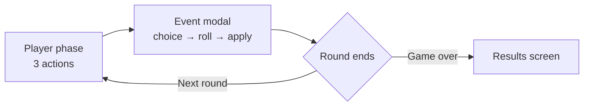

# All According to Plan

A browser-based dystopian political strategy card game. You govern a fragile authoritarian state across **25 rounds**, balancing three factions with propaganda, security, patronage, and economic control.

> “Everything is fine. The system is stable.”

---

## Concept

Inspired by tabletop campaigns (Arkham Horror, Eldritch Horror) and dystopian governance fiction, each run is a structured loop of **limited actions**, **hand management**, and **crisis events** with dice-weighted outcomes.

You are not chasing a single “win” screen every run. You survive the campaign, steer through **election years**, and are graded at the end as **victory**, **survival**, or **failure** based on faction health and a stability index.

---

## Quick start

```bash
npm install
npm run dev
```

- **Web client:** [http://localhost:3000](http://localhost:3000) (`apps/web`, Next.js 15)
- **API (placeholder):** NestJS on its configured port (`apps/api`)

Other scripts:

| Command | Description |
|--------|-------------|
| `npm run build` | Build all workspaces (Lerna, dependency order) |
| `npm run lint` | Lint all packages |
| `npm run format` | Prettier across the repo |

---

## Campaign structure

| Setting | Value |
|--------|--------|
| Rounds | 25 (`maxRounds`) |
| Actions per round | 3 |
| Opening hand | 5 cards |
| Max hand size | 8 |
| Starting resources | 14 money, 0 influence, 0 authority |

### Phases

1. **`player`** — Spend up to 3 actions (play card, draw, or gain resource).
2. **`event_modal`** — After the 3rd action, a round event opens (normal crisis or **election**). Choose a response, roll dice, apply outcome, then continue.
3. **`game_over`** — Campaign ended (round 25, collapse, or election failure).



---

## Factions and stats

Three factions, each with three stats (clamped **0–10**):

| Faction | Role |
|--------|------|
| **People** | Mass mood and compliance |
| **Elites** | Patronage networks and regime backers |
| **Security** | Coercion capacity and internal order |

| Stat | Meaning |
|------|---------|
| **Satisfaction** | Short-term approval / comfort |
| **Loyalty** | Long-term alignment with the regime |
| **Fear** | Pressure and repression (high fear increases instability risk) |

**Collapse:** If **all three** factions have satisfaction ≤ 0 at end-of-round resolution, the run ends in **failure**.

---

## Resources

| Resource | Typical use |
|----------|-------------|
| **Money** | Playing cards, event fallout, round upkeep |
| **Influence** | Patronage and narrative cards |
| **Authority** | Security and hard-power plays |

Resources cannot go below zero. Card costs are optional partial costs (`money`, `influence`, `authority`).

---

## Player actions (3 per round)

| Action | Effect |
|--------|--------|
| **Play card** | Pay cost, apply immediate effects and optional `gain`, schedule delayed effects, remove card from hand |
| **Draw card** | Draw one from deck (reshuffle discard first if deck empty); if hand is full, top card is **burned** to discard |
| **Gain resource** | +1 money, influence, or authority |

After the third action, the engine enters the **event modal** automatically (`beginEventModal`).

---

## Cards: assets vs events

Cards live in `packages/shared/src/data/cards.json`. Legacy `type` archetypes (`propaganda`, `economy`, etc.) are normalized in the engine:

| Engine type | Typical archetypes | On play |
|-------------|-------------------|---------|
| **`asset`** | economy, strategy, social | Stays in **`activeAssets`**; **not** discarded; **passive** effects apply at the start of each new round |
| **`event`** | propaganda, security, etc. | Goes to **`deckDiscard`** after play |

### Effect layers

| Field | When it applies |
|-------|-----------------|
| `immediateEffects` | When the card is played |
| `passiveEffects[]` | Start of each round while asset remains active |
| `delayedEffects[]` | Scheduled for **next round** (`round + 1`) |
| `gain` | Resources granted on play |

You cannot play the same **asset** twice while it is already in `activeAssets`.

---

## Deck, hand, and reshuffle

- **Hand** — Card IDs you can play (max 8).
- **Deck** — Draw pile (shuffled at campaign start).
- **Discard** — Burned draws and played **event** cards.

When the deck is empty and discard has cards, the discard pile is **reshuffled** into a new deck using a **deterministic seed**:

`hash(gameSeed : round : reshuffle : reshuffleCount)`

The same campaign seed and actions produce the same shuffle order. `reshuffleCount` increments on each reshuffle.

---

## Events and dice

After 3 player actions, a **blocking event modal** runs:

1. **Choice** — Pick a response (no resource cost on choices).
2. **Rolling** — UI auto-rolls after a short delay.
3. **Revealed** — Shows dice (1–100) and outcome band: **success**, **partial success**, or **failure**.
4. **Applied** — Stat and resource deltas from the chosen branch are committed.
5. **Continue** — End-of-round upkeep runs and the next round begins.

Dice uses deterministic RNG:

`roll = f(gameSeed, round, choiceId)` mapped to probability thresholds from the choice.

Normal events rotate from a mock library (`MOCK_EVENTS` in `packages/game-engine`). Each offers multiple branches with different success/partial/failure tables.

---

## Election years

On rounds **4, 8, 12, 16, 20, 24** (`round % 4 === 0` and `round < 25`), a special **Election Year** event replaces the normal crisis.

- One choice: **Hold Elections**.
- Success odds are computed from current stats:
  - `score = P×0.5 + E×0.3 + S×0.2 − F×0.2`  
    (P = people satisfaction, E = elites loyalty, S = security loyalty, F = people fear)
  - High / medium / low score bands map to different success/partial/failure percentages.

**Election failure** ends the campaign **immediately** with `gameResult.type = 'failure'` (“You lost the election…”).

The game-over timeline marks election rounds on the UI.

---

## End of round (after event Continue)

When you continue after an applied event:

1. **Instability drift** on all factions: satisfaction −0.15, loyalty −0.1, fear +0.1 (then clamped).
2. **Bonus draw** — One card (respects hand cap, burn, and reshuffle rules).
3. **Upkeep** — +1 money.
4. Event recorded in `eventHistory`.
5. If round was **25** or **collapse** → `game_over` with final scoring.
6. Otherwise **round + 1**, reset actions, apply **scheduled delayed** effects due this round, then **passive asset** effects.

---

## End of campaign

| Result | Condition |
|--------|-----------|
| **Failure** | All faction satisfactions ≤ 0, or election dice failure |
| **Victory** | Stability index ≥ 62 (derived from satisfaction, loyalty, fear per faction) |
| **Survival** | Finished 25 rounds without failure, but stability below victory threshold |

**Score** (rounded):  
`people.satisfaction×2 + elites.loyalty×2 + security.fear + sum(resources)`

The web **Game Over** screen shows animated stats, timeline (with election badges), log, and restart.

---

## Web UI (apps/web)

| Area | Purpose |
|------|---------|
| **Timeline** | Current round; election markers |
| **Faction board** | People / elites / security stats |
| **Card bar** | Hand, costs, asset vs event styling, actions |
| **Played cards** | Cards played this round and active assets |
| **3D scene** | Stalinist monumental city (Three.js), orbit + day/night toggle |
| **Crisis panel** | Pending event summary |
| **Event modal** | Choice → roll → outcome → continue |
| **Advisor panel** | Phase hints and last log lines |

State is held in Zustand and driven by `@all-according-to-plan/game-engine` (pure TypeScript, no `Math.random` in rules).

---

## Monorepo layout

```
all-according-to-plan/
├── apps/
│   ├── web/                 # Next.js 15 — main game UI
│   └── api/                 # NestJS — placeholder snapshots
├── packages/
│   ├── shared/              # types, constants, cards.json, formatters
│   ├── game-engine/         # rules: play, draw, events, elections, rounds
│   └── ui/                  # shared React pieces (hand rail, action bar)
├── GAME_MECHANICS.md        # Detailed rules reference (engine-aligned)
└── README.md
```

| Package | Role |
|---------|------|
| `@all-according-to-plan/shared` | `GameState`, cards data, stat/resource helpers |
| `@all-according-to-plan/game-engine` | All transitions: `playCard`, `drawCard`, `gainResource`, event flow, `continueAfterAppliedEvent` |
| `@all-according-to-plan/web` | Client |
| `@all-according-to-plan/api` | Optional backend hook (minimal today) |

**Stack:** npm workspaces, Lerna, TypeScript, React 19, Zustand, Tailwind CSS, Three.js.

---

## Detailed mechanics

For step-by-step engine behavior, validation errors, and state field reference, see **[GAME_MECHANICS.md](./GAME_MECHANICS.md)**.

---

## Audio

Browser soundscape (Howler + procedural fallbacks): see **[apps/web/AUDIO.md](apps/web/AUDIO.md)**. Enable via the in-game **Audio** control after load.

---

## License

Private project — see repository owner for terms.
